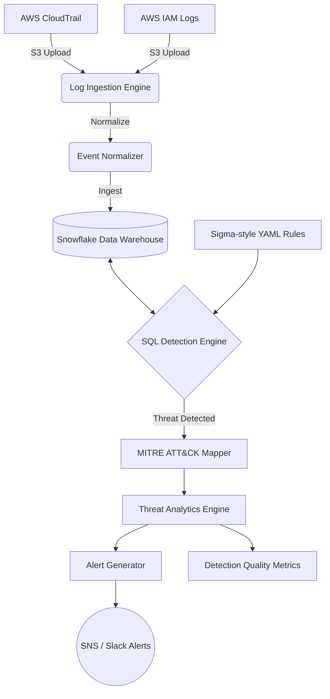

# Cloud Threat Detection & Log Analytics Pipeline

An end-to-end threat detection pipeline ingesting AWS CloudTrail and IAM logs into Snowflake, with SQL-based detections identifying privilege escalation, data exfiltration, and account compromise.

## Architecture



## Features
- **Cloud Log Ingestion:** Automated ingestion of AWS CloudTrail and IAM logs into normalized schemas.
- **Snowflake Analytics:** High-performance analytical queries against massive telemetry datasets.
- **SQL-Based Detection Engine:** Detect privilege escalation, data exfiltration, account compromise, and anomalous behavior using complex SQL joins and aggregations.
- **Detections-as-Code:** Modular, Sigma-style YAML rules.
- **MITRE ATT&CK Mapping:** Automated tagging of alerts with tactical and technical identifiers (e.g., T1098, T1078).
- **CI/CD Automation:** Automated GitHub Actions workflows for testing rules via Pytest, checking syntax, and continuous deployment to Snowflake.
- **Infrastructure-as-Code:** Terraform configurations for provisioning AWS S3, CloudTrail, IAM Roles, and Snowflake integrations.
- **Detection Quality Metrics:** Real-time tracking of precision, recall, false positive rates, and Mean Time to Detect (MTTD).

## Project Structure

```text
├── src/
│   ├── ingestion/         # Fetch logs from S3
│   ├── normalization/     # Normalize into consistent schemas
│   ├── detections/        # Sigma-style YAML rules
│   ├── analytics/         # Snowflake SQL engine & threat correlation
│   ├── mitre_mapping/     # ATT&CK enrichment
│   ├── alerting/          # Alert generation and formatting
│   ├── metrics/           # Quality tracking (Precision/Recall)
│   └── ci_cd/             # Custom YAML schema validation
├── tests/                 # Pytest test suites
├── terraform/             # AWS and Snowflake IaC
└── .github/workflows/     # CI/CD pipelines
```

## Getting Started

### 1. Provision Infrastructure
Use Terraform to deploy the necessary AWS and Snowflake resources.
```bash
cd terraform
terraform init
terraform apply
```

### 2. Configure Environment
Set the required environment variables:
```bash
export SNOWFLAKE_ACCOUNT="your_account"
export SNOWFLAKE_USER="your_user"
export SNOWFLAKE_PASSWORD="your_password"
export SNS_ALERT_TOPIC_ARN="arn:aws:sns:us-east-1:123456789012:cloud-threat-alerts"
```

### 3. Install Dependencies
```bash
python -m venv venv
source venv/bin/activate
pip install -r requirements.txt
```

### 4. Run Tests locally
```bash
pytest tests/
```

### 5. Execute Detections locally
```bash
python -m src.analytics.sql_detection_engine
```

## Detections

This pipeline includes built-in detections for:
- Suspicious IAM Privilege Escalation (`T1098`)
- Account Compromise - Unauthorized Login (`T1078`)
- Suspicious Data Exfiltration from S3 (`T1530`)

New rules can be added to `src/detections/` using the custom YAML schema.

## CI/CD Pipeline

The project utilizes GitHub Actions for continuous integration and deployment.
- **Detection CI:** Validates the YAML syntax of new rules on Pull Requests.
- **Pytest Validation:** Runs the Python unit test suite for all backend pipeline changes.
- **Deploy Rules:** Deploys verified rules to Snowflake production environments upon merge to `main`.
